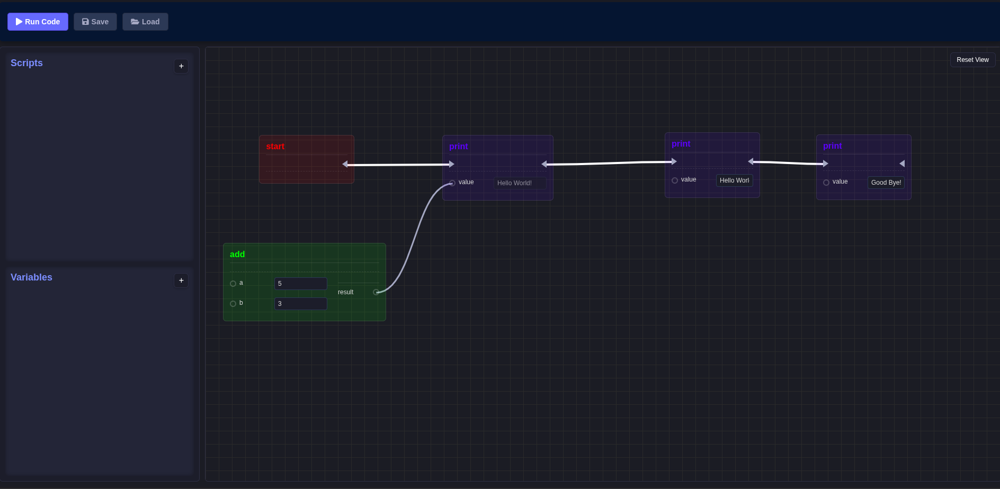
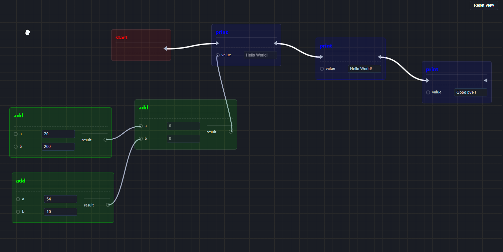

# BRE Documentation

## Bases

Once on the site, you will see 3 sections:
- Tools: allow you to transform your blocks into Luau code, save and load your project.
- Explorer: allows the creation of variables and scripts.
- Editor: allows you to create and connect your blocks.

## Create your first blueprint

By default, you have the "Start" block. It is an event, and in any case your script must begin with an event.

Next, you need to create your blocks. You have two different types of blocks:
- METHOD: requires executive connections, has inputs and outputs.
- FUNCTION: does not require executive connections, has inputs and outputs.

A METHOD block is generally an instruction, while a FUNCTION block is a callable function. For example, addition is a function, while print is an instruction.

Exec connections are traceable via triangles, while data connections are traceable via circles, opposite the names of inputs and outputs. As their name suggests, these are data that flow from one block to another.

## Execution

Once your script is finished, you can click on the Run button, and a window will open with the Luau code. You just need to copy and paste it wherever you want!

## FAQ

### How to open the nodes menu ?

Do a right click in the editor, anywhere, not on a node or on a cable.

### How to delete a node ?

Do a right click on the node.

### How to delete a cable (exec or data) ?

Do a right click on the cable you want to delete.

### How to import a project ?

Click on the button "Load" in tools section and select the file, it has to be in .json format !

### How to save a projet ?

Click on the button "Save" and select a location.
WARNING: Don't change the file format!

### How to move into the editor ?

Do a left click anywhere and move with your mouse. As long as you hold down the click, you will move around in the editor.

### How do I come back to the default view in the editor ?

Click on the button "Reset View" at the top right in the editor window.

## Example 1

## Example 2
