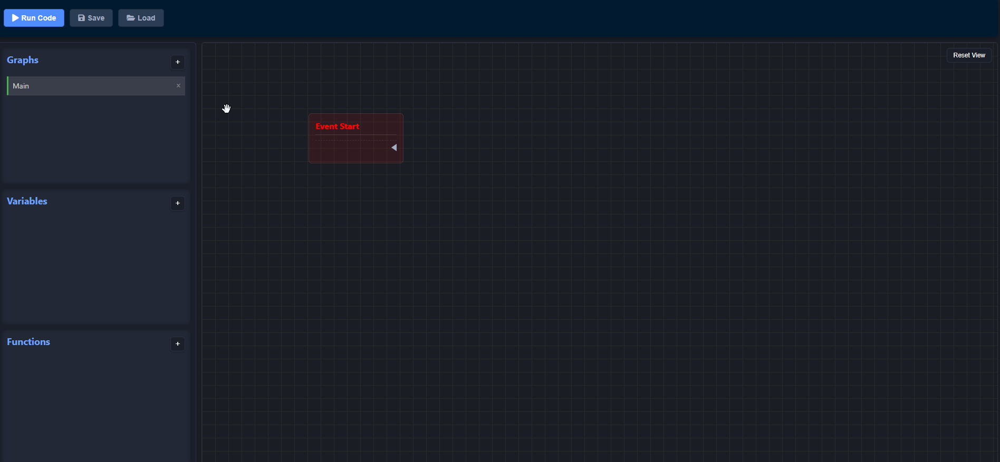
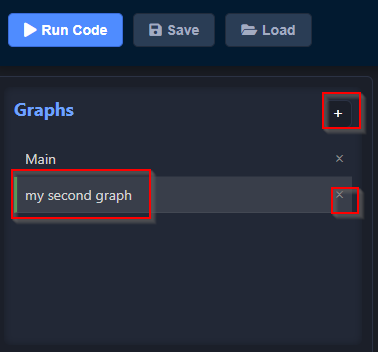
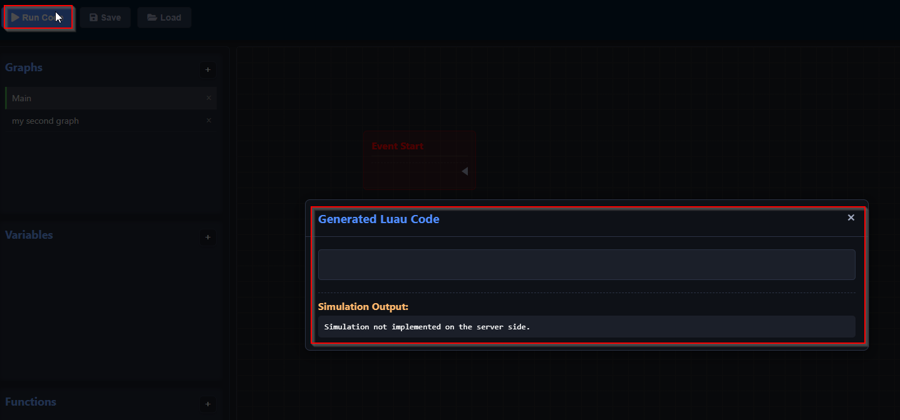
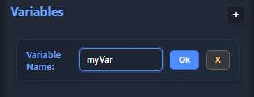
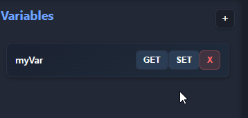
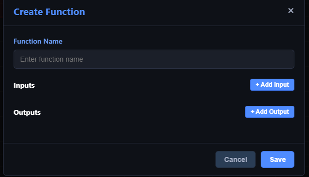
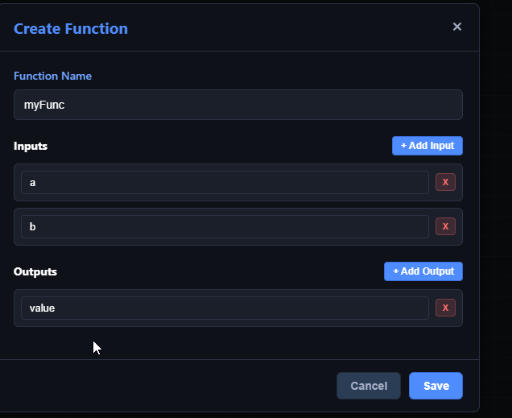
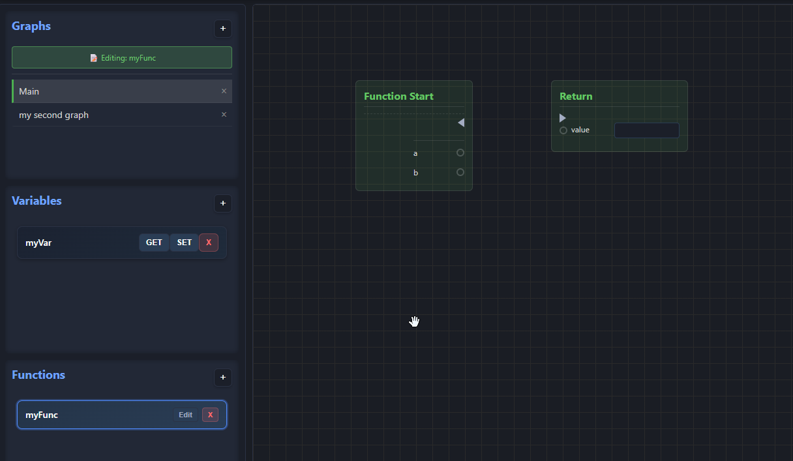

# Documentation

Firstly, launch the application by running `python app.py` in the root directory.

Then move to `http://localhost:80/` in your web browser.



You can create more graphs, modify their content and delete them if need.


You can also see the graph to a **Luau**.


Moreover, you can save and load a project you created (click on the save button to save your project, or load if you want to load one).

Then, it's possible for you to create variables : 



You can also create functions : 


And edit the content of your custom function : 


## Node creation

Make sure to follow the format:
```json
{
    "type": "METHOD",
    "title": "Node title",
    "color": [200,200,200],
    "inputs": {
        "input_name": {
            "defaultValue": "default_input_value"
        }
    },
    "outputs": [
        "output_name"
    ]
}
```

- `color` is not mandatory, but you can create your own color using RGB values.
- `inputs` and `outputs` are not mandatory, but you need to have at least inputs empty and outputs empty like : 
```json
{
    "type": "METHOD",
    "title": "Node title",
    "color": [200,200,200],
    "inputs": {},
    "outputs": []
}
```
- `exec`is for special statement, you can use it but make sure to edit the backend side.
- `type` can be `METHOD`, `FUNCTION`, `EVENT`, connections: 
    * events: one execution as output
    * methods: one execution as input and one execution as output
    * functions: one execution as input and one execution as output

Example of a math node:
```json
{
    "type": "METHOD",
    "title": "Add",
    "color": [200,200,200],
    "inputs": {
        "a": {
            "defaultValue": "0"
        },
        "b": {
            "defaultValue": "0"
        }
    },
    "outputs": [
        "result"
    ]
}
```

Example of a custom event:
```json
{
    "type": "EVENT",
    "title": "Custom Event",
    "color": [200,200,200],
    "inputs": {},
    "outputs": []
}
```

Moreover you need to create the python class : 
```python
from src.Node import Node

class CustomNode(Node):
    def __init__(self):
        super().__init__("path/to/node.json")

    def toLuau():
        return 'warn("Custom Node")'
```

# FAQ

### How to open the nodes menu ?

Do a right click in the editor, anywhere, not on a node or on a cable.

### How to delete a node ?

Do a right click on the node.

### How to delete a cable (exec or data) ?

Do a right click on the cable you want to delete.

### How to import a project ?

Click on the button "Load" in tools section and select the file, it has to be in .json format !

### How to save a projet ?

Click on the button "Save" and select a location.
WARNING: Don't change the file format!

### How to move into the editor ?

Do a left click anywhere and move with your mouse. As long as you hold down the click, you will move around in the editor.

### How do I come back to the default view in the editor ?

Click on the button "Reset View" at the top right in the editor window.